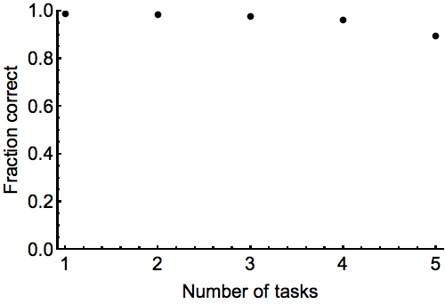

## Elastic weight consolidation

### Introduction

A TensorFlow implementation of elastic weight consolidation as presented in [Overcoming catastrophic forgetting in neural networks](http://www.pnas.org/content/114/13/3521.full).

### Usage

Perform hyperparameter search over learning rates for the permuted MNIST task (fisher multiplier locked at inverse learning rate):
```
python -u main.py --hidden_layers 2 --hidden_units 800 --num_perms 5 --trials 50 --epochs 100
```

### Results

<br>
<p align="left"></p>
<br>